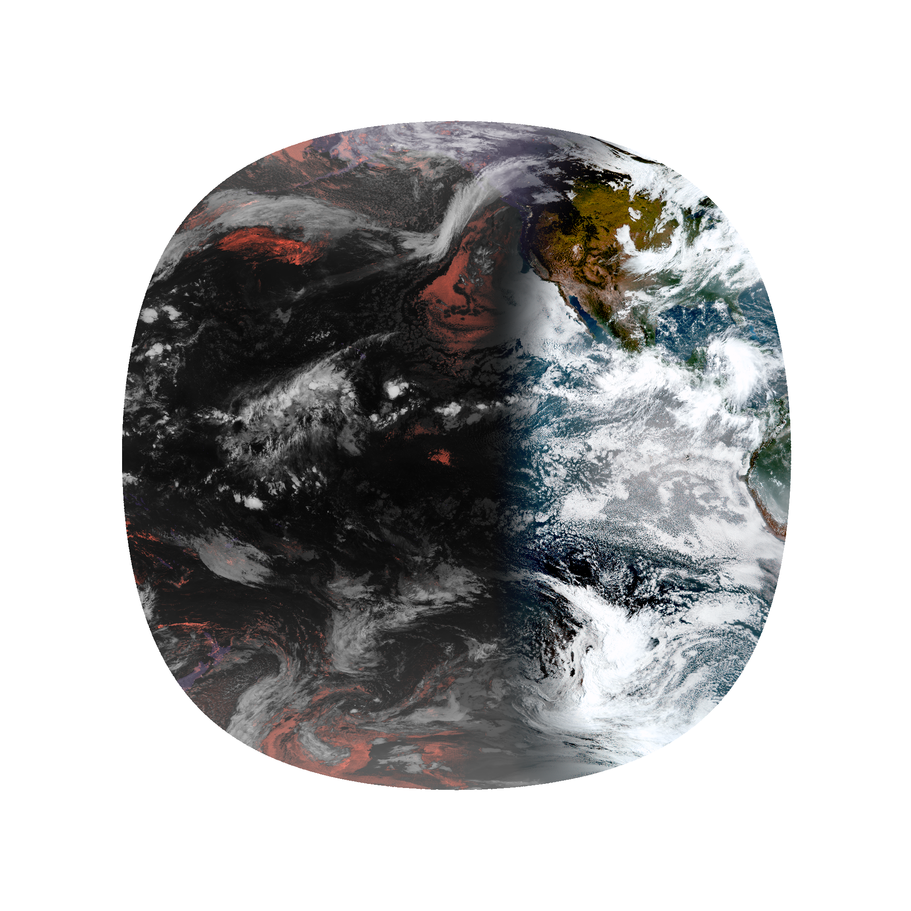
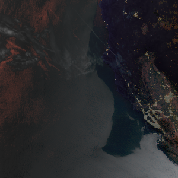

# More comparison Photos!

| Before Update | After Update |
|---------------|--------------|
|  |  |
|  |  |

## Past Projects: 

### Interested in learning about other plugins? Example using RyglickiCane Plugin:

### Colorbar adjustments based off windspeeds at certains intervals:

 | 

[Back to the Homepage](./index.md)
