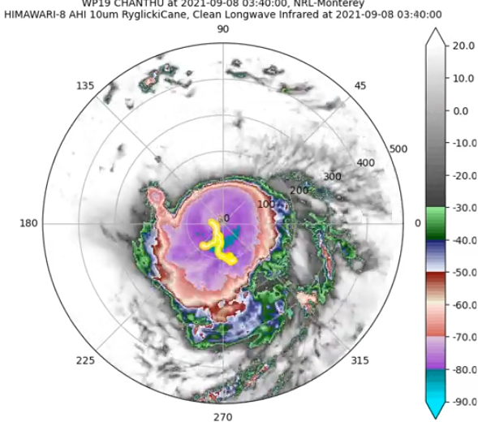
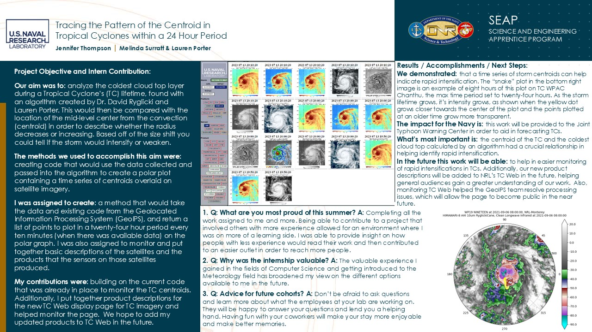
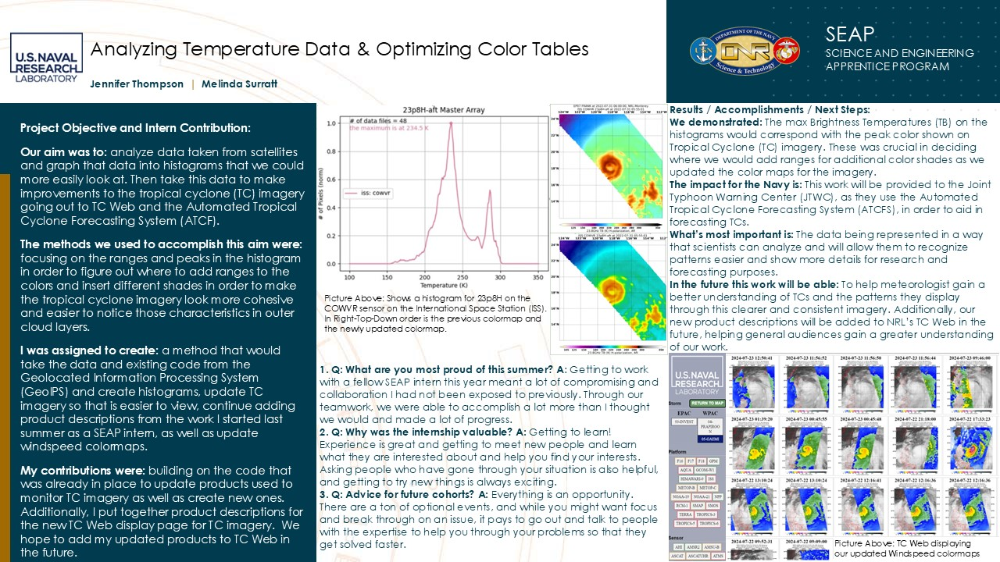

## Past Projects: 

### Interested in learning about other plugins? Example using RyglickiCane Plugin:

*click for an animation!*

### Colorbar adjustments based off windspeeds at certains intervals:

 | 

### Quad Charts from previous Science and Engineering Achievement Programs (SEAP):

 

[Back to the Homepage](./index.md)
